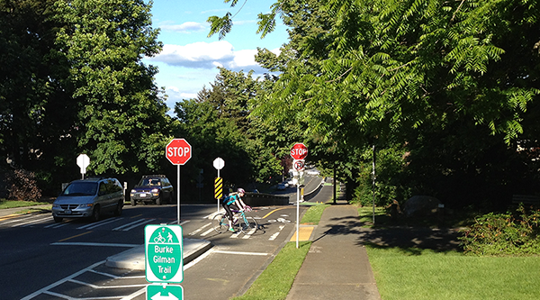

I am an assistant professor of [Urban and Regional Planning](http://ap.buffalo.edu/) at [University at Buffalo (SUNY)](http://www.buffalo.edu/). My research interests focus on the interaction between urban forms and human behaviors. I am studying how to promote active transportation (walking, bicycling, and transit use) and healthy behaviors through urban form changes. I believe our everyday lives are strongly influenced by where we move around.

I use quantitative methods to measure behaviors, to describe environments, and to understand how the behaviors and the environments interact. I developed an algorithm classifying walking activity and its behavioral types using accelerometer, GPS, and travel diary data. I’m interested in spatial modeling and spatial data development to better answer the question of environment-behavior interaction.

Before joining UB, I was a research associate at [Urban Form Lab](http://depts.washington.edu/ufl/) in University of Washington, and a urban designer/researcher at Seoul Development Institute (currently [the Seoul Institute](http://www.si.re.kr/)). As trained as an architect/urban designer, in general, I’m interested in new city forms that will come with new technologies in the future.

